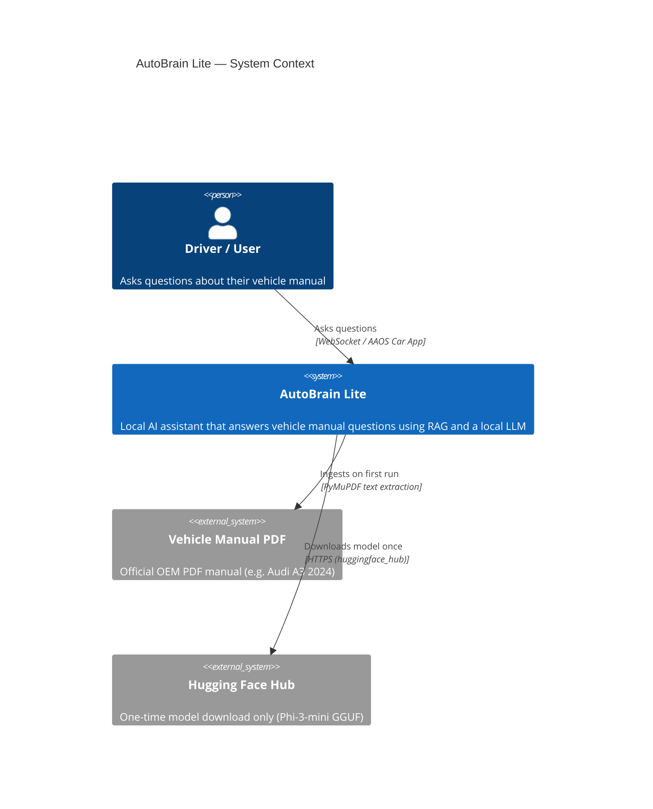
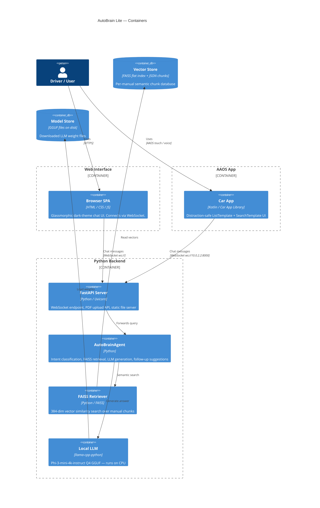
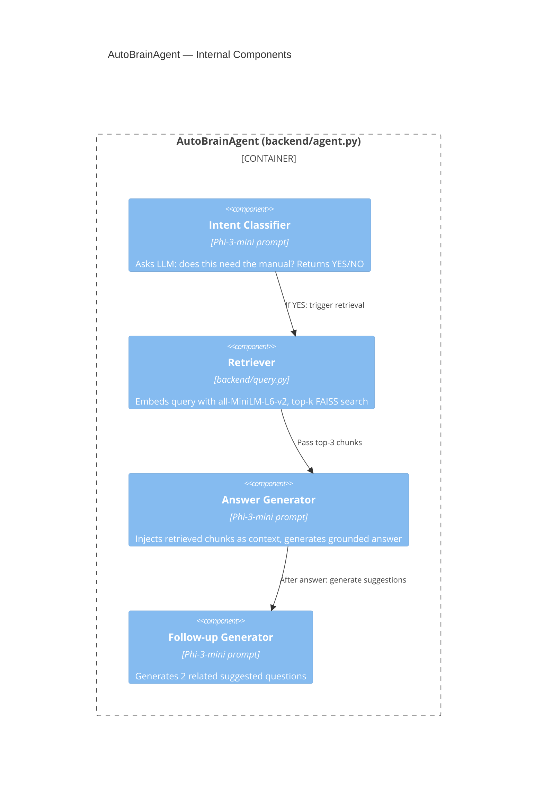
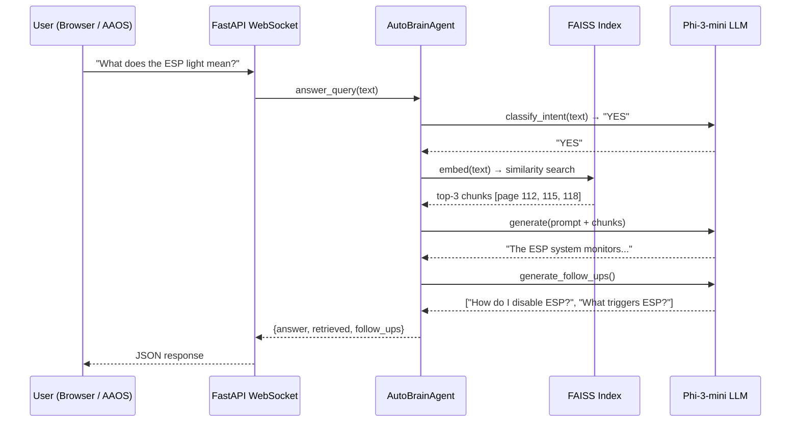
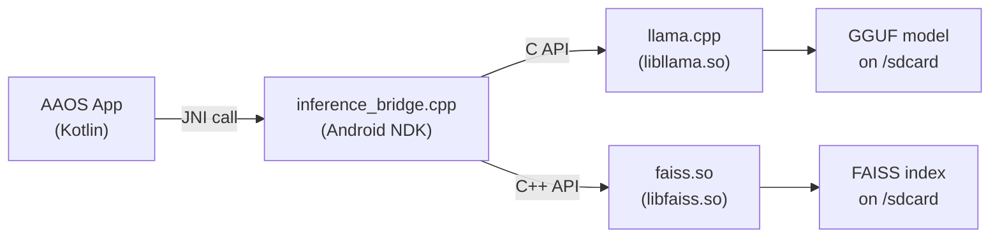

# AutoBrain Lite — Architecture Documentation

## C4 Model: Context Level (Level 1)

---

## C4 Model: Container Level (Level 2)

---

## C4 Model: Component Level (Level 3) — AutoBrainAgent

---

## Data Flow — Single Query

---

## Production JNI Architecture (Future)

In a real AAOS deployment the Python server is replaced by a native C++ library
called directly from the Android NDK, eliminating the HTTP overhead entirely:

See [`native/inference_bridge.cpp`](../native/inference_bridge.cpp) for the stub implementation.
